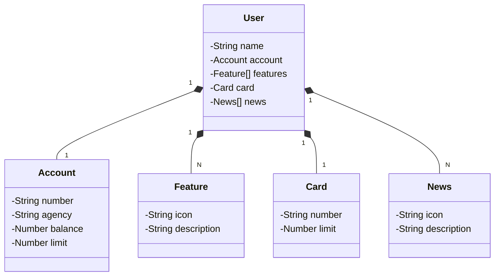

# Santander Dev Week 2023 Java API
Este repositório contém o código-fonte da RESTful API desenvolvida para o desafio do projeto Lab Santander Week 2023 em parceria com a DIO.me, com o objetivo de promover estudos e aprendizado.

## Visão Geral
A API foi construída em Java 17 utilizando o framework Spring Boot 3, aproveitando as tecnologias mais recentes para proporcionar uma experiência de desenvolvimento eficiente e moderna.

## Principais Tecnologias

- **Java 17**: Utilizado a **versão LTS** mais recente do Java para aproveitar as inovações e melhorias da linguagem.

- **Spring Boot 3**:  O **framework Spring Boot** oferece produtividade e facilidade de configuração, permitindo focar no desenvolvimento das funcionalidades da API.

- **Spring Data JPA**: Com o **Spring Data JPA**, simplificamos o acesso aos dados do banco, integrando facilmente com bancos de dados SQL.

- **OpenAPI (Swagger)**: A **documentação da API** foi gerada automaticamente utilizando o OpenAPI (Swagger), tornando-a clara e de fácil entendimento.

- **Railway**: facilita o deploy e monitoramento de nossas soluções na nuvem, além de oferecer diversos bancos de dados como serviço e pipelines de CI/CD.

## Recursos Adicionais
**Figma**:Foi utilizado o Figma para abstrair o domínio da API, auxiliando na análise e no projeto da solução.

### [Link do Figma](https://www.figma.com/file/0ZsjwjsYlYd3timxqMWlbj/SANTANDER---Projeto-Web%2FMobile?type=design&node-id=1421%3A432&mode=design&t=6dPQuerScEQH0zAn-1)

## Diagrama de Classes (Domínio da API)
Ilustração de um diagrama de classes que representa o domínio da API, facilitando a compreensão da estrutura do sistema.

## Documentação da API
A documentação da API está disponível através do Swagger, onde é possível visualizar todos os endpoints, seus parâmetros e respostas.

### [Documentação da API (Swagger)](https://sdw-2023-prd.up.railway.app/swagger-ui.html)

## Links de aramzenamento

- **URL de Produção**: [Railway](https://sdw-2023-production-mr180886.up.railway.app)

- **Contolador de Usuários**: [Swagger](https://sdw-2023-production-mr180886.up.railway.app/swagger-ui/index.html#/Users%20Controller/delete)

Este repositório é destinado principalmente para fins de estudo e aprendizado, mas também pode ser utilizado como um ponto de partida para projetos futuros. Sinta-se à vontade para explorar, clonar e modificar o código conforme necessário.
