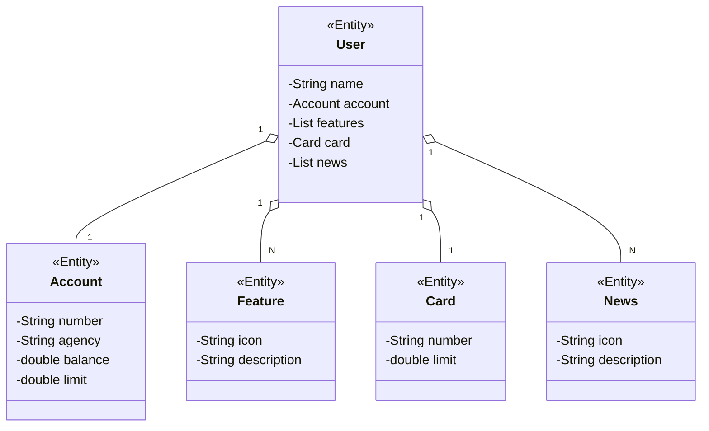

# Santander Dev Week 2023

JAVA RESTful API criada para Santander Dev Week 2023

## Diagrama de classes

```mermaid
classDiagram
    class User {
        <<Entity>>
        -String name
        -Account account
        -List<Feature> features
        -Card card
        -List<News> news
    }
    class Account {
        <<Entity>>
        -String number
        -String agency
        -double balance
        -double limit
    }
    class Feature {
        <<Entity>>
        -String icon
        -String description
    }
    class Card {
        <<Entity>>
        -String number
        -double limit
    }
    class News {
        <<Entity>>
        -String icon
        -String description
    }
    User "1" o--"1" Account
    User "1" o--"N" Feature
    User "1" o--"1" Card
    User "1" o--"N" News
```
